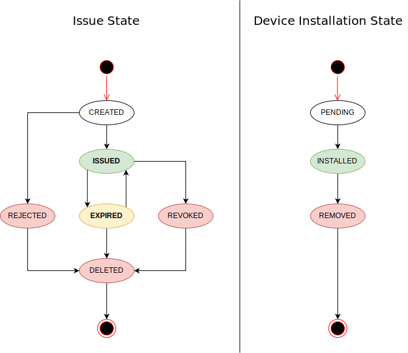

# Contagio Client

* **Teststation iOS App**
* **contagio-server**

# Starten
Mit Docker Compose MongoDB und Server starten
```
docker-compose -p contagio up -d
```

# Contagio Server

## create docker image
```
cd contagio-server
docker build -t contagio_server:<tag> .
docker tag contagio_server:<tag> ghcr.io/ischlecken/contagio:<tag>
docker push ghcr.io/ischlecken/contagio:<tag>
```

## recreate on sloppy
```
sloppy delete contagio
sloppy start sloppy.json
```

##
Beschreibung fehlt, wie man an das passende Zertifikat kommt zum Signieren des Passes

## Spring Boot Konfigurieren für https
```
openssl pkcs12 -export -in www-contagio-de.crt -inkey www-contagio-de.key -out www-contagio-de.p12 -name contagio -CAfile contagioRootCA.crt -caname root
keytool -importkeystore -deststorepass contagio123 -destkeypass contagio123 -destkeystore contagio.jks -srckeystore www-contagio-de.p12 -srcstoretype PKCS12 -srcstorepass contagio123 -alias contagio
keytool -import -trustcacerts -alias root -file contagioRootCA.crt -keystore contagio.jks -storepass contagio123

keytool -list -keystore contagio.jks

```

## Lokalen DNS manipulieren
auf macos /etc/hosts editieren
```
192.168.169.59  www.contagio.de
```

## Mongodb
MongoDb in Dockercontainer starten
```
docker-compose -p contagio up -d mongodb
```

MongoDb in Dockercontainer stoppen
```
docker-compose -p contagio down
```

MongoDb in Dockercontainer stoppen und Daten löschen
```
docker-compose -p contagio down -v
```

# State Diagram



# Links
PKPass Validator
https://pkpassvalidator.com/

JPasskit
https://github.com/drallgood/jpasskit
